# D — Diagrama AS-IS: Gestão e Fiscalização de Contratos na APF

**Serviço:** Gestão e Fiscalização de Contratos na Administração Pública Federal  
**Perspectiva:** Fiscal / Gestor de Contrato (o "cliente" da jornada — Shostack)  
**Legenda de setas:** `-->` entrega/handoff formal · `-.->` consulta, retorno ou risco  
**Legenda de nós:** 🟦 Etapa · 🟩 Ator · 🟪 Sistema de Suporte · 🟥 Fail Point `[/ /]`

```mermaid
flowchart LR

    %% ── ATORES ────────────────────────────────────────────────────────────
    RH([RH · Adm])
    Fiscal([Fiscal / Gestor])
    Prep([Preposto · Contratada])
    FA([Fiscal Adm.])
    Fin([Financeiro · Ord. Despesa])
    Jur([Jurídico])

    %% ── SISTEMAS DE SUPORTE ───────────────────────────────────────────────
    SEI[(SEI)]
    SIAFI[(SIAFI)]
    CND[(Portais CND\ne-Social)]
    SICAF[(SICAF · CEIS)]
    Compras[(Compras.gov.br)]

    %% ── ETAPAS ────────────────────────────────────────────────────────────
    E1[1 · Designação\ne Assunção]
    E2[2 · Reunião Inicial\nKick-off]
    E3[3 · Acompanhamento\ne Rotina]
    E4[4 · Recebimento\nProvisório]
    E5[5 · Recebimento\nDefinitivo · Ateste]
    E6[6 · Encaminhamento\ne Pagamento]
    E7[7 · Ocorrências\ne Sanções]
    E8[8 · Aditivos ou\nEncerramento]

    %% ── FAIL POINTS ───────────────────────────────────────────────────────
    FP1[/⚠ Designação genérica:\ninviabilidade material/]
    FP2[/⚠ Acordos verbais\nsem registro em ata/]
    FP3[/⚠ Shadow IT — canal\nnão rastreável · DEDMO/]
    FP4[/⚠ CND como véu — PC-5\nculpa in vigilando/]
    FP5[/⚠ Ateste cego\nEfeito Carimbador — PC-3/]
    FP6[/⚠ Quebra ordem cronológica\nomissão 11% INSS/]
    FP7[/⚠ Ameaça verbal sem\ninstrução — prescrição PC-6/]
    FP8[/⚠ Pedido pós-vencimento\ncontrato verbal/]

    %% ── ESPINHA DORSAL DA JORNADA ─────────────────────────────────────────
    E1 --> E2 --> E3 --> E4 --> E5 --> E6
    E6 --> E7
    E6 --> E8

    %% ── ETAPA 1: Designação e Assunção ────────────────────────────────────
    RH -->|publica portaria| E1
    E1 -.->|arquiva Termo de Ciência| SEI
    E1 -.->|⚠ um fiscal · vários contratos| FP1

    %% ── ETAPA 2: Reunião Inicial ──────────────────────────────────────────
    Fiscal -->|convoca reunião · define SLAs| E2
    Prep -->|credencial do preposto| E2
    E2 -.->|registra ata| SEI
    E2 -.->|⚠ sem documentação formal| FP2

    %% ── ETAPA 3: Acompanhamento e Rotina ─────────────────────────────────
    Fiscal -->|mede IMR in loco · notifica falhas| E3
    Prep -.->|resposta e plano de ação| E3
    FA -->|dados consolidados dos setoriais| E3
    E3 -.->|⚠ comunicação por canal não oficial| FP3

    %% ── ETAPA 4: Recebimento Provisório ──────────────────────────────────
    Prep -->|medição + CNDs + guias trabalhistas| E4
    FA -->|análise fiscal e previdenciária| E4
    E4 -.->|consulta regularidade| CND
    E4 -.->|⚠ certidão válida ≠ trabalhadores pagos| FP4

    %% ── ETAPA 5: Recebimento Definitivo e Ateste ─────────────────────────
    Prep -->|Nota Fiscal para ateste| E5
    E5 -.->|ateste registrado| SEI
    E5 -.->|⚠ gestor assina sem revisar| FP5

    %% ── ETAPA 6: Encaminhamento e Pagamento ──────────────────────────────
    Fin -->|liquida no SIAFI · retém 11% INSS| E6
    E6 -.->|emite Ordem Bancária| SIAFI
    E6 -->|pagamento à contratada| Prep
    E6 -.->|⚠ inversão de fila · omissão retenção| FP6

    %% ── ETAPA 7: Ocorrências e Sanções ───────────────────────────────────
    Fiscal -->|notificação extrajudicial| Prep
    Prep -.->|defesa escrita| E7
    E7 -->|encaminha contraditório| Jur
    Jur -.->|parecer jurídico| E7
    E7 -.->|registra sanção| SICAF
    E7 -.->|⚠ sem instrução processual| FP7

    %% ── ETAPA 8: Aditivos ou Encerramento ────────────────────────────────
    Jur -.->|valida minuta do aditivo| E8
    Fin -.->|confirma disponibilidade orçamentária| E8
    E8 -.->|pesquisa de mercado| Compras
    E8 -.->|⚠ pedido após vencimento contratual| FP8

    %% ── ESTILOS ───────────────────────────────────────────────────────────
    classDef etapa      fill:#dbeafe,stroke:#1d4ed8,color:#1e3a5f,font-weight:bold
    classDef ator       fill:#dcfce7,stroke:#15803d,color:#14532d
    classDef sistema    fill:#f3e8ff,stroke:#7e22ce,color:#3b0764
    classDef failpoint  fill:#fee2e2,stroke:#dc2626,color:#7f1d1d,font-style:italic

    class E1,E2,E3,E4,E5,E6,E7,E8 etapa
    class Fiscal,RH,Prep,FA,Fin,Jur ator
    class SEI,SIAFI,CND,SICAF,Compras sistema
    class FP1,FP2,FP3,FP4,FP5,FP6,FP7,FP8 failpoint
```

---

## Posicionamento Shostack — Em qual camada cada nó opera

| Nó | Camada Shostack | Linha divisória |
|:---|:---|:---|
| Fiscal / Gestor | Ações do Fiscal (acima da Linha de Interação) | — |
| RH · Adm | Frontstage (entrega portaria visível ao fiscal) | abaixo da Linha de Interação |
| Preposto · Contratada | Frontstage | abaixo da Linha de Interação |
| Fiscal Adm. | Backstage | abaixo da Linha de Visibilidade |
| Financeiro · Ord. Despesa | Backstage | abaixo da Linha de Visibilidade |
| Jurídico | Backstage | abaixo da Linha de Visibilidade |
| SEI · SIAFI · CND · SICAF · Compras.gov.br | Processos de Suporte | abaixo da Linha de Interação Interna |

> **Erro recorrente identificado no grill (Rodadas 1–6):** o Fiscal/Gestor opera na camada
> **Ações do Fiscal**, acima da Linha de Interação — nunca no Frontstage.
> O Frontstage é exclusivamente a camada do Preposto e da Contratada.

---

## Leitura dos Fail Points no Diagrama

| Símbolo | Etapa de origem | Normativo violado | Ponto Cego (se aplicável) |
|:---|:---|:---|:---|
| FP1 — Designação genérica | E1 | Decreto 11.246/2022, Art. 21 | — |
| FP2 — Acordos verbais | E2 | IN SEGES 05/2017 | — |
| FP3 — Shadow IT · DEDMO | E3 | Lei 14.133, Art. 117 §1º | PC-4 |
| FP4 — CND como véu | E4 | Súmula 331 V TST · Art. 121/14.133 | PC-5 |
| FP5 — Ateste cego | E5 | Lei 14.133, Art. 140 II | PC-3 |
| FP6 — Ordem cronológica · 11% | E6 | IN 77/2022 · Lei 8.212, Art. 31 | — |
| FP7 — Prescrição por omissão | E7 | Lei 14.133, Arts. 155-163 | PC-6 |
| FP8 — Contrato verbal | E8 | Lei 4.320/64, Art. 60 | — |
