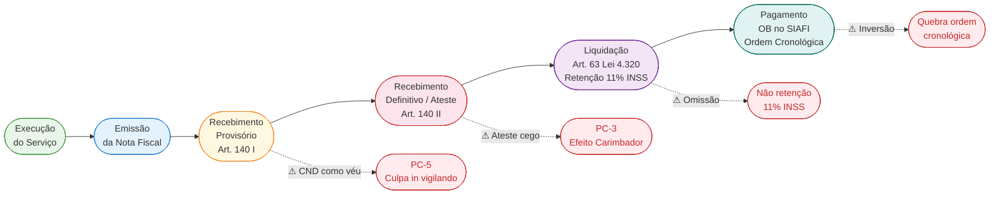
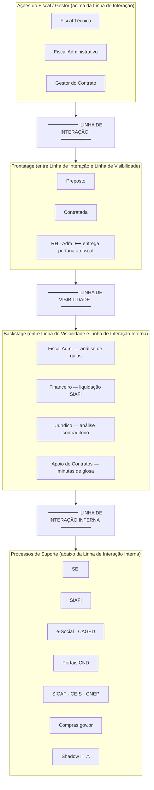

# D — Diagrama de Relações: Gestão e Fiscalização de Contratos na APF

**Artefato:** diagrama de handoffs (sequência Mermaid) + matriz RACI + fluxo do dinheiro  
**Referência cruzada:** cada ator e etapa aqui aparece em `C_grill_transcript.md` e `C_blueprint_asis.md`

---

## 1. Diagrama de Handoffs — Sequência de Interações por Etapa

> Leitura: setas sólidas (→) = entrega formal; setas tracejadas (⇢) = retorno/resposta.  
> Notas à direita = fail points críticos [C] ou operacionais [O] discutidos nas Rodadas 1–6 do grill.

```mermaid
sequenceDiagram
    participant F  as Fiscal / Gestor
    participant RH as RH · Adm
    participant P  as Preposto · Contratada
    participant FA as Fiscal Adm.
    participant Fin as Financeiro · Ord. Despesa
    participant Jur as Jurídico

    rect rgb(230, 238, 255)
        Note over F,RH: ETAPA 1 — Designação e Assunção
        RH->>F: Portaria de designação (SEI)
        F->>F: Lê TR / Contrato / Matriz de Riscos
        F-->>RH: Assina Termo de Ciência
        Note right of F: ⚠ [C] Designação genérica — inviabilidade material
    end

    rect rgb(230, 255, 230)
        Note over F,P: ETAPA 2 — Reunião Inicial (Kick-off)
        F->>P: Convoca reunião; pauta SLAs e canais oficiais
        P->>F: Credencial do preposto + proposta operacional
        F-->>RH: Ata de reunião arquivada no SEI
        Note right of F: ⚠ [O] Acordos verbais sem registro em ata
    end

    rect rgb(255, 255, 220)
        Note over F,FA: ETAPA 3 — Acompanhamento e Rotina
        F->>P: Notificações de falha de IMR (e-mail institucional)
        P-->>F: Resposta / plano de ação
        FA->>F: Dados consolidados dos fiscais setoriais
        Note right of F: ⚠ [C] Shadow IT (WhatsApp) sem rastreabilidade
        Note right of F: ⚠ [C] Não verificação da conta DEDMO
    end

    rect rgb(255, 225, 225)
        Note over F,FA: ETAPA 4 — Recebimento Provisório
        P->>F: Medição + CNDs + guias trabalhistas/previdenciárias
        FA->>F: Análise de regularidade fiscal e previdenciária
        F->>F: Emite Termo de Recebimento Provisório
        Note right of F: ⚠ [C] CND como véu (PC-5) — certidão válida ≠ trabalhadores pagos
        Note right of F: ⚠ [C] Culpa in vigilando → Súmula 331 V TST
    end

    rect rgb(255, 230, 255)
        Note over F,P: ETAPA 5 — Recebimento Definitivo e Ateste
        P->>F: Nota Fiscal para ateste
        F->>F: Consolida pareceres técnico e administrativo
        F->>F: Assina ateste definitivo na NF (SEI)
        Note right of F: ⚠ [C] Ateste cego — Efeito Carimbador (PC-3)
    end

    rect rgb(220, 242, 255)
        Note over F,Fin: ETAPA 6 — Encaminhamento e Pagamento
        F->>Fin: Processo autuado + despacho SEI
        Fin->>Fin: Liquida despesa no SIAFI
        Fin->>Fin: Retém 11% INSS (Lei 8.212/91, Art. 31)
        Fin-->>P: Emite Ordem Bancária (OB)
        Note right of Fin: ⚠ [C] Quebra da ordem cronológica (IN 77/2022)
        Note right of Fin: ⚠ [C] Omissão da retenção de 11% INSS
    end

    rect rgb(255, 248, 220)
        Note over F,Jur: ETAPA 7 — Ocorrências e Sanções
        F->>P: Notificação extrajudicial com prazo de defesa
        P-->>F: Defesa escrita
        F->>Jur: Encaminha processo para análise do contraditório
        Jur-->>F: Parecer jurídico
        Note right of F: ⚠ [C] Ameaça verbal sem instrução → prescrição (PC-6)
    end

    rect rgb(238, 255, 238)
        Note over F,Jur: ETAPA 8 — Aditivos ou Encerramento
        F->>Fin: Relatório técnico avaliativo
        F->>Jur: Minuta do Termo Aditivo para validação
        Jur-->>F: Parecer de viabilidade jurídica
        Fin-->>F: Confirmação de disponibilidade orçamentária
        Note right of F: ⚠ [C] Pedido após vencimento → contrato verbal (Lei 4.320, Art. 60)
    end
```

---

## 2. Matriz RACI — Responsabilidades por Etapa e Ator

> **R** = Responsible (executa) · **A** = Accountable (responde pelo resultado) · **C** = Consulted (input necessário) · **I** = Informed (mantido a par)

| Etapa | Fiscal Técnico | Fiscal Adm. | Gestor | RH · Adm | Preposto · Contratada | Financeiro · Ord. | Jurídico |
|:---|:---:|:---:|:---:|:---:|:---:|:---:|:---:|
| 1. Designação e Assunção | I | I | **R / A** | **R** | — | I | C |
| 2. Reunião Inicial (Kick-off) | **R** | C | **A** | I | **R** | — | C |
| 3. Acompanhamento e Rotina | **R** | **R** | **A** | — | C | — | — |
| 4. Recebimento Provisório | **R** | **R** | **A** | — | **R** | — | — |
| 5. Recebimento Definitivo e Ateste | C | C | **R / A** | — | C | — | — |
| 6. Encaminhamento e Pagamento | I | I | **A** | — | C | **R** | — |
| 7. Ocorrências e Sanções | **R** | C | **A** | — | C | I | **R** |
| 8. Aditivos ou Encerramento | **R** | C | **A** | — | C | C | **R** |

**Leituras críticas da matriz:**

- O **Gestor** é *Accountable* em todas as 8 etapas — ele nunca escapa da responsabilidade, mesmo quando não é o *Responsible*.
- Na Etapa 5, o Gestor acumula **R/A** sem suporte de nenhum ator *Responsible* paralelo → é o ponto estrutural do Efeito Carimbador (PC-3).
- Na Etapa 6, o Gestor é *Accountable* mas o Financeiro é *Responsible*: o Gestor responde por consequências de atos que não controla diretamente (retenção de INSS, ordem cronológica).
- Quando um servidor acumula Fiscal Técnico + Fiscal Administrativo + Gestor, as colunas 1, 2 e 3 colapsam em uma única pessoa que detém **R/A** em todas as etapas simultaneamente — sem nenhum ponto de C ou I independente (Rodada 5, Q3–Q4).

---

## 3. Fluxo do Dinheiro — Rastreabilidade Cronológica Obrigatória

> Qualquer inversão nestas seis etapas sequenciais constitui grave irregularidade financeira (Lei 4.320/64). Discutido extensivamente na Rodada 4.



**Gap normativo identificado no grill (Rodada 4, Q2):** entre os Passos 4 e 5 existe um buraco que a Lei 4.320/64 e a ON AGU 76/2023 não fecham — o ateste ideologicamente falso. Um ateste forjado satisfaz formalmente ambas as normas enquanto o Estado paga por serviço não recebido.

---

## 4. Linhas Divisórias do Shostack — Onde os Atores Cruzam



**Nota de leitura:** o erro recorrente identificado em 5 das 6 rodadas do grill (Rodada 5, observação final) foi posicionar o Fiscal/Gestor no Frontstage. O diagrama acima torna essa distinção estruturalmente explícita: o Fiscal está acima da Linha de Interação; o Frontstage (preposto, contratada) está abaixo dela.
